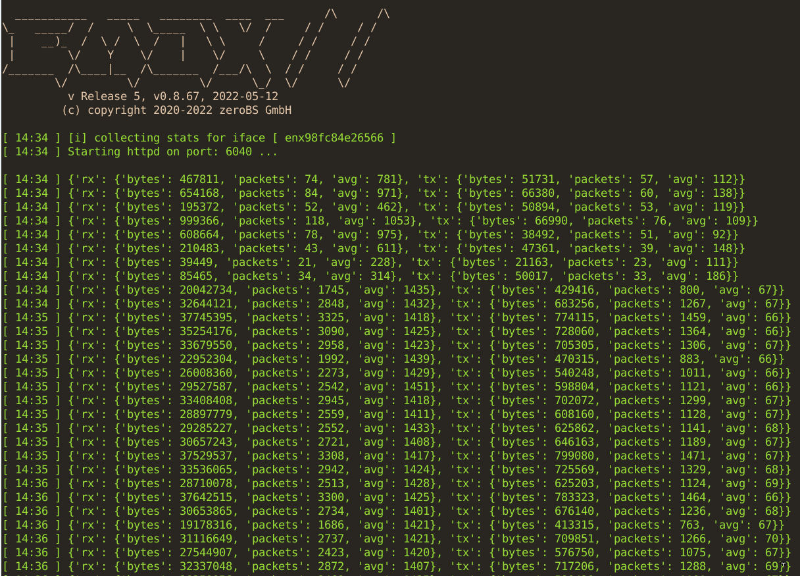
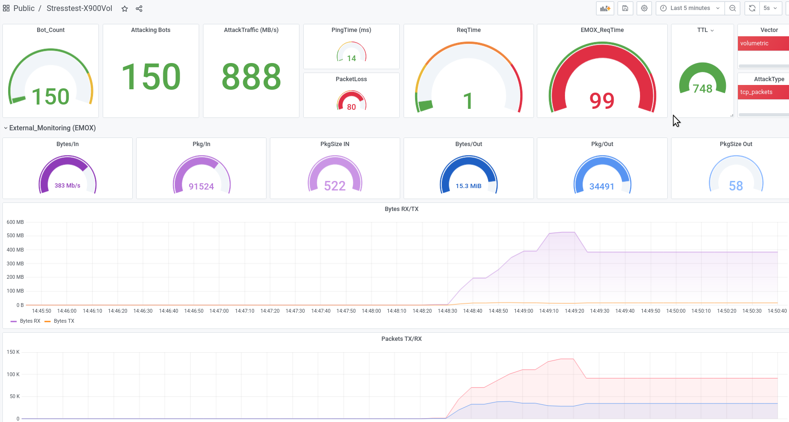

# EMOX/GNA - external monitoring - sensor to be used with zeroBS ddos-stresstest-platform

- v5 or later

- a simple node to be installed into a clients network 
- GNA -> the node to collect the stats locally
- EMOX -> gna-display (external monitoring exchange)

Desc: Emox/gna is a toolset to collect and display trafficdata
inside a datacenter, especially for ddos-stresstests.

it consits of a local sensor that can be shoot at with tcp/udp - traffic
(gna) and a monitoring-endpoint tha can collect and display
data from multiple gna-endpoints, allowing for a fine-granular display
of reachability and the performance of your anti-ddos-solution

[GNA - reference](https://en.wikipedia.org/wiki/Gn%C3%A1_and_H%C3%B3fvarpnir)

gna-engine to feed the EMOX-display

EMOX-display while running a test

# requirements

- any linux, debian-based preferred
- required programs:
    - python3 with standardlibs (tested for 3.5 and above)
    - python3-simplejson 
    - tmux
    - git
    - vnstat
  
- any small vps/node/server with a public IP that is accessible from the internet
- NIC should be at least 1 GB/s
- no docker, because this sensor needs access to /sys/ from the hostnachine to collect stats
- if possible, no firewall or any tafficdopping until the NIC
- incase of testing-networks, can be used as a target for TCP/UDP - attacks
  to measure the traffic that actually reaches the target
- can simulate any tcp/udp - service to be shoot at

# Setup

- git clone https://github.com/zerobs-loic/emox
- run `install.sh` as root to install required packages
- if you dont run debian, install the required packages manually
- rest can run as normal user (if not SELINUX is inplace)
- a sample-config will be created as well

## Configuration

`config.py`

~~~~

## sample-config

iface = "eth0"

file_only = "no"
srv_port = 6040

my_idx = "icanhazcheesburgerZ1337"

~~~~

## Operating (default mode)

- simply reboot the node to regain full funtionality

- for manual tests, see gna.py

- for automated operation, see run.sh, a shellscript 
  that creates a tmux-session for the sensor to run into 

- during install, a cronjob has been created that runs the main loop

- you can always execute `run.sh` manually

## Running gna behind an nginx / reading and delivering the static stats-file (non default)

Please note: the automated installer-scripts has been tested for
debian-based systems. If you want to install it on other
OS, dont expect the installer-script to run smoothely (esp.
not on a BSD), so you need to execute all steps from the script manually

 
- this is the preferred method when using nginx
- set `file_only = "yes"` in config.py
- run `sudo ./install_nginx.sh` or execute steps manually
- run the gna/stats-script to create the file only
- beware of the umask for the user that runs gna, the nginx-user must be able
  to read the stats-file
- the automatically generated nginx_config is in `/etc/nginx/sits-enabled/gna-ssl`

## Running gna behind an nginx / proxying to the gna-service (untested)

Please note: the automated installer-scripts has been tested for
debian-based systems. If you want to install it on other
OS, dont expect the installer-script to run smoothely (esp.
not on a BSD), so you need to execute all steps from the script manually

- untested, dont use yet
- set `file_only = "no"` in config.py
- run `sudo ./install_nginx.sh` or execute steps manually
- run the gna-script to have this as a service
- the automatically generated nginx_config is in `/etc/nginx/sits-enabled/gna-ssl`

- change the config-file to have the following added: 

~~~

proxy_cache_path /tmp/nginx/cache levels=1:1 keys_zone=GNACACHE:1m;

location / {

    proxy_pass http://localhost:12345; 
    # maybe proxy_cache as well
  
    proxy_cache GNACACHE;
    proxy_cache_key $scheme$proxy_host$request_uri;
    proxy_cache_use_stale  off;
    proxy_cache_valid 5s;

}

~~~

# Documentation / values

v5 - 2021-03

- file_only mode to work with nginx 
- nginx-receipts included 
- TX: transmitting/sending
- RX: receiving
- packets: real packets
- bytes: bytes
- avg: avg packet size (bytes / packets(

~~~~

{'tx': 
  {
    'avg': 405, 
    'packets': 10, 
    'bytes': 33086.4
  }, 
 'rx': 
  {
    'avg': 105, 
    'packets': 11, 
    'bytes': 9584.0
  }

}

~~~~

